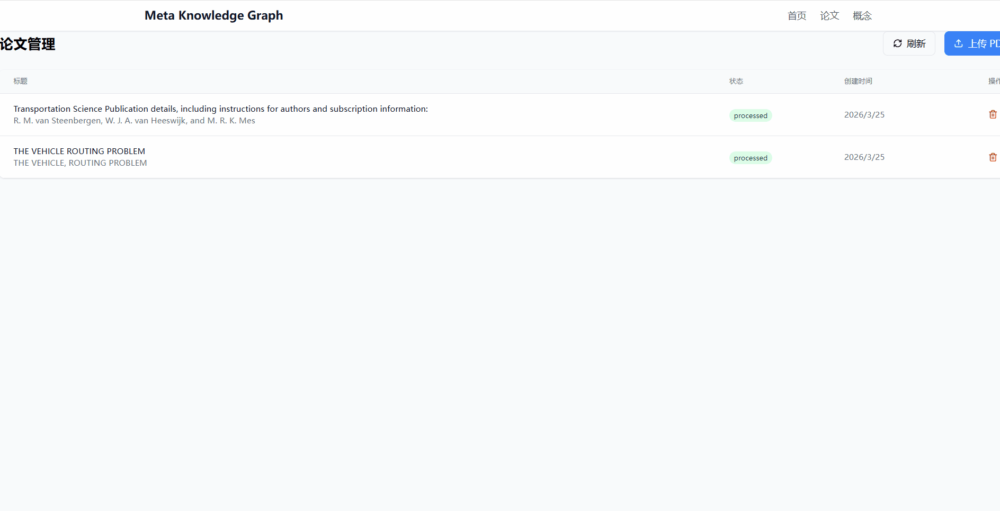
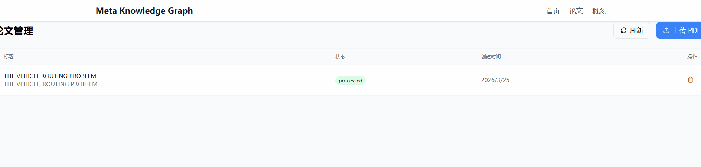

<p align="center">
  
</p>

<h1 align="center">Meta Knowledge Graph</h1>

<p align="center">
  <a href="README_CN.md">简体中文</a> | <strong>English</strong>
</p>

<p align="center">
  <strong>LLM-powered Academic Knowledge Graph Engine</strong>
</p>

<p align="center">
  
  
  
  
  
</p>

<p align="center">
  Automatically extract hierarchical concepts from PDF papers<br>
  with interactive force-directed graph visualization
</p>

---

## Demo

### Knowledge Graph Interaction



*Features: Interactive graph → Click concept → Discover research points → Deduplication → Multi-format export*

### Paper Upload & Processing



*Features: Upload PDFs → Batch processing → View extraction results*

---

## Key Features

| Feature | Description |
|---------|-------------|
| 📄 **PDF Parsing** | Extract title, authors, abstract automatically |
| 🧠 **Two-Stage Extraction** | Stage 1: Paper understanding → Stage 2: Core concept extraction |
| 📊 **Visualization** | Obsidian/Neo4j-style force-directed graph |
| 🔍 **Research Discovery** | Four methodologies: gap filling, leaf extension, bottleneck, transfer |
| 🔄 **Smart Deduplication** | Three merge types: synonym, absorption, translation |
| 📤 **Multi-format Export** | HTML, Obsidian Canvas, Markdown |
| 📁 **Folder Management** | Collapsible sidebar for paper organization |
| ⚡ **Queue Processing** | Sequential batch processing with time estimation |
| 🐳 **Docker Ready** | One-command deployment with Docker Hub image |

---

## Architecture

```
┌─────────────────────────────────────────────────┐
│                  Frontend                        │
│         React + TypeScript + D3.js               │
└─────────────────────┬───────────────────────────┘
                      │ REST API
┌─────────────────────▼───────────────────────────┐
│                  Backend                         │
│      FastAPI + SQLite + PyMuPDF                  │
└─────────────────────┬───────────────────────────┘
                      │ LLM API
┌─────────────────────▼───────────────────────────┐
│                 LLM Layer                        │
│      Claude / Gemini / Qwen / DeepSeek           │
└─────────────────────────────────────────────────┘
```

**Data Flow:** `PDF → LLM Extract (Two-Stage) → Knowledge Graph → Export`

---

## Quick Start

### Docker (Recommended)

```bash
# Pull and run
docker pull danceinsophy/meta-knowledge-graph:latest
docker run -d -p 8088:8088 \
  -e ANTHROPIC_API_KEY=sk-ant-xxx \
  -v mkg-data:/app/data \
  -v mkg-papers:/app/papers \
  danceinsophy/meta-knowledge-graph:latest
```

Open http://localhost:8088

> Replace `ANTHROPIC_API_KEY` with your API key. Also supports `GOOGLE_API_KEY`, `OPENAI_API_KEY`, or `DASHSCOPE_API_KEY`

### Docker Compose

```bash
# Clone and run
git clone https://github.com/Seaual/meta-knowledge-graph.git
cd meta-knowledge-graph/docker

# Set your API key
export ANTHROPIC_API_KEY=sk-ant-xxx

# Start
docker-compose up -d
```

### Manual Setup

<details>
<summary>Click to expand</summary>

```bash
# Clone
git clone https://github.com/Seaual/meta-knowledge-graph.git
cd meta-knowledge-graph

# Backend
python -m venv venv
source venv/bin/activate  # Linux/Mac, or: venv\Scripts\activate (Windows)
pip install -r requirements.txt

# Configure LLM
cp .env.example .env
# Edit .env with your API key

# Frontend
cd frontend && npm install

# Start
python -m uvicorn backend.main:app --port 8088 --reload &
cd frontend && npm run dev
```

</details>

---

## Feature Details

### Two-Stage Concept Extraction

```
Stage 1: Paper Understanding
├── Research context identification
├── Core contribution distinction
└── Background/novel concept classification

Stage 2: Concept Extraction
├── Anchor path (paper positioning)
├── Contribution subtree (actual contributions)
└── Contribution role annotation (proposed/improved/applied/analyzed)
```

### Research Point Discovery Methods

| Method | Description |
|--------|-------------|
| 🔍 **Gap Filling** | Missing connections between related branches |
| 🌱 **Leaf Extension** | Leaf nodes applied to other branches |
| 🔥 **Bottleneck** | Node with many children but few siblings |
| 🔄 **Transfer** | Mature methods transferred to unsolved problems |

### Concept Hierarchy

| Category | Description | Example |
|----------|-------------|---------|
| field | Major domain | Artificial Intelligence |
| direction | Research direction | Multi-Agent RL |
| subdirection | Sub-direction | Value Decomposition |
| task | Research task | Credit Assignment |
| method | Algorithm | QMIX |
| technique | Technical detail | Attention-weighted mixing |

---

## Usage

### Upload Papers
1. Go to **Papers** page
2. Click upload button, select PDF files (batch supported)
3. Papers appear in **Pending** list

### Process Papers
1. Click **Process** or **Batch Process**
2. LLM extracts concept tree
3. Concepts added to knowledge graph

### Explore Graph
1. Go to **Concepts** page
2. Drag nodes, scroll to zoom
3. Click concept for details

### Discover Research Points
1. Click a concept node
2. Click **Discover Research Points**
3. LLM analyzes graph structure, generates 3-5 research directions

### Deduplicate
1. Click **Dedup Scan**
2. Review merge suggestions (synonym/absorption/translation)
3. Execute selected merges

### Export Graph
- **HTML** - Interactive D3.js force-directed graph (standalone)
- **Canvas** - Obsidian Canvas format
- **Markdown** - Double-link format notes

---

## Supported LLM Providers

| Provider | Type | Configuration |
|----------|------|---------------|
| **Anthropic Claude** | Native API | `ANTHROPIC_API_KEY` |
| **Claude CLI** | Local CLI | Automatic |
| **Google Gemini** | Native API | `GOOGLE_API_KEY` |
| **Alibaba DashScope** | OpenAI Compatible | `DASHSCOPE_API_KEY` |
| **OpenRouter** | OpenAI Compatible | `OPENAI_API_KEY` + base_url |
| **DeepSeek** | OpenAI Compatible | Custom base_url |
| **MiniMax** | OpenAI Compatible | Custom base_url |

---

## Tech Stack

**Backend:** Python 3.10+ • FastAPI • SQLite • PyMuPDF

**Frontend:** React 18 • TypeScript • Vite • TailwindCSS • D3.js

**LLM:** Claude / Gemini / Qwen / DeepSeek / OpenRouter

---

## Project Structure

```
meta-knowledge-graph/
├── backend/           # FastAPI backend
│   ├── main.py        # App entry
│   ├── routes/        # API routes
│   └── schemas.py     # Data models
├── frontend/          # React frontend
│   └── src/
│       ├── pages/     # Page components
│       └── components/
├── mkg/               # Core library
│   ├── database.py    # Database operations
│   ├── graph.py       # Graph operations
│   ├── pdf_parser.py  # PDF parsing & LLM extraction
│   └── dedup/         # Deduplication module
├── papers/            # Paper storage
├── icon/              # Project icons
└── PROMPT_GUIDE.md    # Prompt engineering guide
```

---

## API Reference

Access http://localhost:8088/docs after starting

| Endpoint | Method | Description |
|----------|--------|-------------|
| `/api/papers/upload` | POST | Upload PDF |
| `/api/papers/batch-upload` | POST | Batch upload |
| `/api/papers/batch-process` | POST | Batch process |
| `/api/concepts/` | GET | Get all concepts |
| `/api/concepts/{id}/research-points` | GET | Discover research points |
| `/api/concepts/dedup/scan` | POST | Scan duplicates |
| `/api/graph/export/obsidian/html` | GET | Export HTML |

---

## Roadmap

- [x] More LLM backends (DeepSeek, OpenRouter, MiniMax)
- [x] Concept deduplication
- [x] Multi-format export
- [x] Batch processing
- [x] Two-stage concept extraction
- [x] Research point discovery methodologies
- [ ] Collaboration features
- [ ] Neo4j support

---

## Contributing

Issues and Pull Requests welcome!

## License

MIT License

---

<p align="center">
  
</p>

<p align="center">
  Made with ❤️ by <a href="https://github.com/Seaual">Seaual</a>
</p>