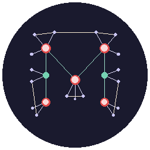

<p align="center">
  
</p>

<h1 align="center">Meta Knowledge Graph</h1>

<p align="center">
  <strong>基于 LLM 的学术知识图谱引擎</strong><br>
  <sub>LLM-powered Academic Knowledge Graph Engine</sub>
</p>

<p align="center">
  
  
  
  
  
</p>

<p align="center">
  从 PDF 论文自动提取概念层级结构，以交互式力导向图可视化展示<br>
  Extract hierarchical concepts from PDF papers with interactive force-directed visualization
</p>

---

## Demo

### 知识图谱交互 / Knowledge Graph Interaction


*展示功能：概念图谱交互 → 点击概念 → 发现研究点 → 概念去重 → 多格式导出*

### 论文上传与处理 / Paper Upload & Processing


*展示功能：上传 PDF → 批量处理 → 查看提取结果*

## 核心特性 / Key Features

| 功能 | 描述 |
|------|------|
| 📄 **PDF 解析** | 自动提取论文标题、作者、摘要等元数据 |
| 🧠 **两阶段概念提取** | Stage 1: 论文理解 → Stage 2: 核心概念提取 |
| 📊 **知识图谱可视化** | 类似 Obsidian/Neo4j 的力导向图交互式展示 |
| 🔍 **研究点发现** | 四种方法论：空白地带、末端延伸、瓶颈识别、迁移应用 |
| 🔄 **智能概念去重** | 三种合并类型：同义词、粒度吸收、翻译对应 |
| 📤 **多格式导出** | 支持 HTML、Obsidian Canvas、Markdown |
| 📁 **文件夹管理** | 可折叠侧边栏，论文分类管理 |

## 架构 / Architecture

```
┌─────────────────────────────────────────────────┐
│                  Frontend                        │
│         React + TypeScript + D3.js               │
└─────────────────────┬───────────────────────────┘
                      │ REST API
┌─────────────────────▼───────────────────────────┐
│                  Backend                         │
│      FastAPI + SQLite + PyMuPDF                  │
└─────────────────────┬───────────────────────────┘
                      │ LLM API
┌─────────────────────▼───────────────────────────┐
│                 LLM Layer                        │
│         Claude / Gemini / Qwen                   │
└─────────────────────────────────────────────────┘
```

**数据流 / Data Flow:** `PDF → LLM Extract (Two-Stage) → Knowledge Graph → Export`

## 快速开始 / Quick Start

### Docker 一键部署 / Docker Deployment

```bash
docker run -d -p 8088:8088 \
  -e ANTHROPIC_API_KEY=sk-ant-xxx \
  -v ./data:/app/data \
  ghcr.io/seaual/meta-knowledge-graph:latest
```

访问 http://localhost:8088 即可使用。

> 将 `ANTHROPIC_API_KEY` 替换为你的 API Key，也支持 `GOOGLE_API_KEY` 或 `DASHSCOPE_API_KEY`

### 手动部署 / Manual Setup

<details>
<summary>点击展开详细步骤</summary>

#### 1. 克隆项目

```bash
git clone https://github.com/Seaual/meta-knowledge-graph.git
cd meta-knowledge-graph
```

#### 2. 后端配置

```bash
python -m venv venv
source venv/bin/activate  # Linux/Mac
# 或 venv\Scripts\activate  # Windows

pip install -r requirements.txt
```

#### 3. 配置 LLM

```bash
cp .env.example .env
```

编辑 `.env` 文件，填入 API Key（三选一）：

```env
# Claude API（推荐）
ANTHROPIC_API_KEY=sk-ant-...

# Google AI Studio
GOOGLE_API_KEY=...

# 阿里云 DashScope
DASHSCOPE_API_KEY=...
```

#### 4. 前端配置

```bash
cd frontend
npm install
```

#### 5. 启动服务

**Windows:**
```bash
start.bat
```

**手动启动:**
```bash
# 后端
python -m uvicorn backend.main:app --host 0.0.0.0 --port 8088 --reload

# 前端（新终端）
cd frontend && npm run dev
```

访问 http://localhost:5173

</details>

## 功能详解 / Feature Details

### 两阶段概念提取 / Two-Stage Concept Extraction

```
Stage 1: 论文理解
├── 研究背景识别
├── 核心贡献区分
└── 背景/新概念分类

Stage 2: 概念提取
├── 锚点路径（定位论文归属）
├── 贡献子树（论文真正贡献）
└── 贡献角色标注（proposed/improved/applied/analyzed）
```

### 研究点发现方法论 / Research Point Discovery Methods

| 方法 | 描述 |
|------|------|
| 🔍 **空白地带法** | 图谱中两个本应有联系的分支缺少连接 |
| 🌱 **末端延伸法** | 叶子节点能否应用到其他分支 |
| 🔥 **瓶颈识别法** | 某节点连接大量子节点但缺少兄弟节点 |
| 🔄 **迁移应用法** | 成熟方法能否迁移到另一个未解决的问题 |

### 概念层级 / Concept Hierarchy

| 类别 | 描述 | 示例 |
|------|------|------|
| field | 大领域 | 人工智能、运筹学 |
| direction | 研究方向 | 多智能体强化学习 |
| subdirection | 子方向 | 值分解方法 |
| task | 研究任务 | 信用分配问题 |
| method | 方法/算法 | QMIX |
| technique | 技术细节 | 注意力加权混合 |

## 使用说明 / Usage

### 上传论文 / Upload Papers

1. 进入「论文」页面
2. 点击上传按钮，选择 PDF 文件（支持批量）
3. 论文将出现在「待处理」列表中

### 处理论文 / Process Papers

1. 点击「处理」按钮或「批量处理」
2. LLM 自动提取概念树
3. 概念添加到知识图谱

### 浏览图谱 / Browse Graph

1. 进入「概念」页面
2. 拖拽节点、滚轮缩放
3. 点击概念查看详情和操作

### 发现研究点 / Discover Research Points

1. 点击概念节点
2. 点击「发现研究点」
3. LLM 分析图谱结构，生成 3-5 个研究方向

### 概念去重 / Deduplication

1. 点击「去重扫描」
2. 查看合并建议（同义词/粒度吸收/翻译对应）
3. 执行选中的合并

### 导出图谱 / Export Graph

- **HTML** - 交互式 D3.js 力导向图（可独立运行）
- **Canvas** - Obsidian Canvas 格式
- **Markdown** - 双链格式笔记

## 技术栈 / Tech Stack

**Backend:** Python 3.10+ • FastAPI • SQLite • PyMuPDF

**Frontend:** React 18 • TypeScript • Vite • TailwindCSS • D3.js

**LLM:** Claude API / Google AI / DashScope

## 项目结构 / Project Structure

```
meta-knowledge-graph/
├── backend/           # FastAPI 后端
│   ├── main.py        # 应用入口
│   ├── routes/        # API 路由
│   └── schemas.py     # 数据模型
├── frontend/          # React 前端
│   └── src/
│       ├── pages/     # 页面组件
│       └── components/
├── openclaw/          # 核心库
│   ├── database.py    # 数据库
│   ├── graph.py       # 图谱操作
│   ├── pdf_parser.py  # PDF 解析 & LLM 提取
│   └── dedup/         # 去重模块
├── papers/            # 论文存储
├── icon/              # 项目图标
├── gif/               # 演示动图
└── PROMPT_GUIDE.md    # Prompt 工程指南
```

## API 文档 / API Docs

启动后访问 http://localhost:8088/docs

| 接口 | 方法 | 描述 |
|------|------|------|
| `/api/papers/upload` | POST | 上传 PDF |
| `/api/papers/batch-upload` | POST | 批量上传 |
| `/api/papers/batch-process` | POST | 批量处理 |
| `/api/concepts/` | GET | 获取所有概念 |
| `/api/concepts/{id}/research-points` | GET | 发现研究点 |
| `/api/concepts/dedup/scan` | POST | 扫描重复概念 |
| `/api/graph/export/obsidian/html` | GET | 导出 HTML |

## 开发计划 / Roadmap

- [x] 支持更多 LLM（DeepSeek、OpenRouter、MiniMax）
- [x] 概念合并与去重
- [x] 多格式导出
- [x] 批量处理
- [x] 两阶段概念提取
- [x] 研究点发现方法论
- [ ] 协作功能
- [ ] Neo4j 支持

## 贡献 / Contributing

欢迎 Issue 和 Pull Request！

## 许可证 / License

MIT License

---

<p align="center">
  
</p>

<p align="center">
  Made with ❤️ by <a href="https://github.com/Seaual">Seaual</a>
</p>