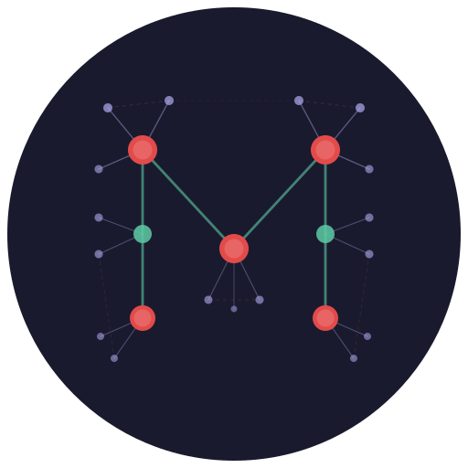
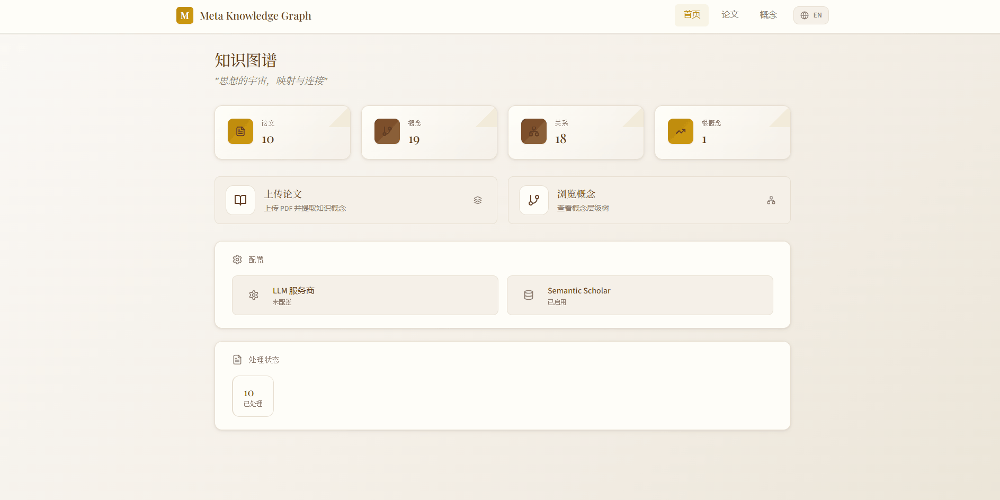
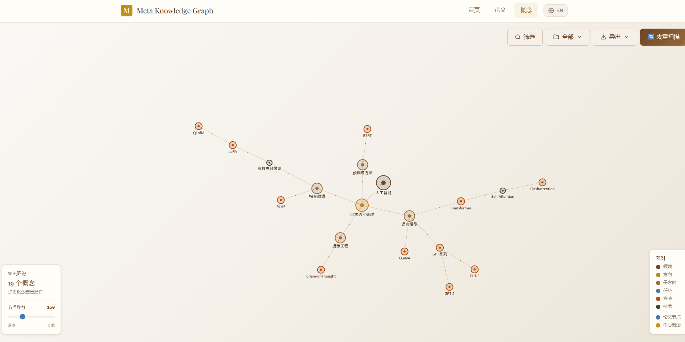
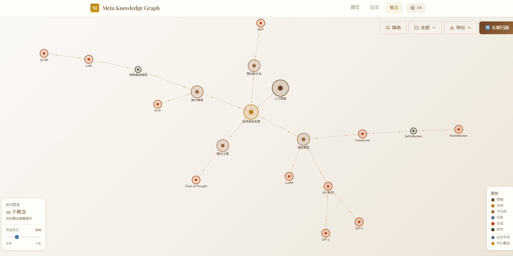
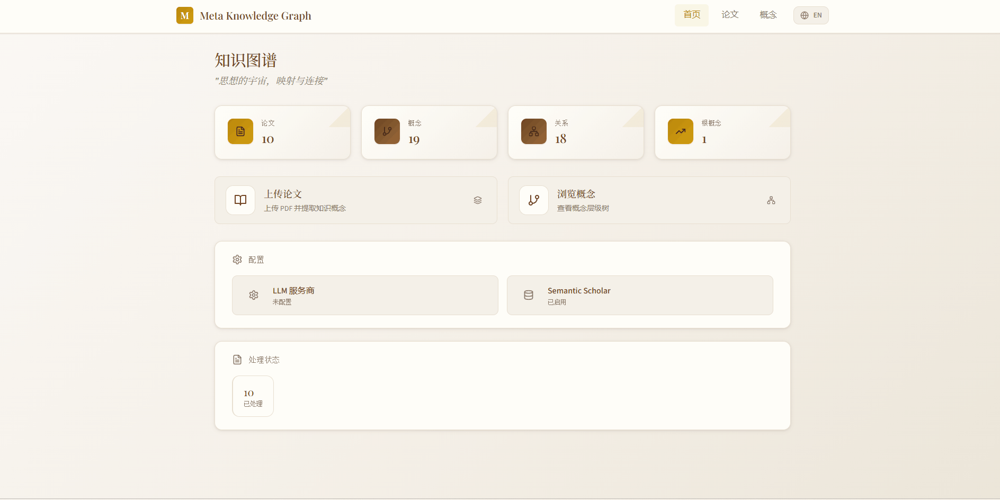

<p align="center">
  
</p>

<h1 align="center">Meta Knowledge Graph</h1>

<p align="center">
  <strong>English</strong> | <a href="README_CN.md">简体中文</a>
</p>

<p align="center">
  <strong>AI Research Agent — Academic Knowledge Graph Engine powered by LLM</strong>
</p>

<p align="center">
  <a href="https://github.com/Seaual/meta-knowledge-graph/stargazers"></a>
  
  
  
  
  
</p>

<p align="center">
  Upload research PDFs → LLM extracts hierarchical concepts →<br>
  build an interactive knowledge graph → discover research opportunities via AI Agents
</p>

<p align="center">
  <a href="#quick-start">Quick Start</a> •
  <a href="#key-features">Features</a> •
  <a href="#ai-agent-system">AI Agents</a> •
  <a href="#architecture">Architecture</a> •
  <a href="#roadmap">Roadmap</a>
</p>

---

## Key Features

| Feature | Description |
|---------|-------------|
| 📄 **PDF Parsing** | Auto-extract title, authors, abstract from research papers (MarkItDown, no Java dependency) |
| 🌍 **Auto-Translation** | LLM-powered bilingual concept names (ZH/EN) for cross-language search |
| 🧠 **Two-Stage Concept Extraction** | Stage 1: Paper understanding → Stage 2: Hierarchical concept extraction with 8 categories |
| 🌐 **Semantic Scholar Integration** | Auto-enhance paper metadata (DOI, citations, venue, citation count) |
| 📊 **Interactive Graph Visualization** | Force-directed graph with category-based node sizes, search & filter |
| 🔍 **Research Point Discovery** | 4 methodologies: Gap Filling, Leaf Extension, Bottleneck, Transfer |
| 🏷️ **Research Point Badges** | Difficulty, novelty, and impact ratings with color-coded badges |
| 📤 **Multi-format Export** | HTML (interactive D3), Obsidian Canvas, Markdown |
| 📁 **Folder Management** | Organize papers into folders with sidebar navigation |
| ⚡ **Queue Processing** | Sequential batch processing with time estimation |
| 🔄 **Smart Deduplication** | Synonym merging, absorption, translation detection |
| 🤖 **AI Research Agents** | Chat-based agents for paper Q&A, citation analysis, deep research |

---

## Demo

### Knowledge Graph Browsing



*Drag nodes, zoom, search concepts, filter by category*

### Research Points Discovery



*Click concept → Discover research points → View analysis context*

### Feature Overview



*Upload PDFs → Process → Explore graph → Export*

### LLM Configuration



*Configure API Key → Test connection → Start processing*

---

## Quick Start

### Option 1: Docker (Recommended)

```bash
docker pull danceinsophy/meta-knowledge-graph:latest
docker run -d -p 8089:8089 \
  -v mkg-data:/app/data \
  -v mkg-papers:/app/papers \
  --restart unless-stopped \
  danceinsophy/meta-knowledge-graph:latest
```

Open http://localhost:8089 — configure your LLM API key in the **Settings** page.

> API Keys are saved locally in the database. Supports Claude, OpenAI, Gemini, Qwen, DeepSeek, and more.

#### Docker Security (Production)

When exposing MKG to the internet, enable Basic Auth:

```bash
docker run -d -p 8089:8089 \
  -e BASIC_AUTH_USER=admin \
  -e BASIC_AUTH_PASSWORD=your-strong-password \
  -v mkg-data:/app/data \
  -v mkg-papers:/app/papers \
  --restart unless-stopped \
  danceinsophy/meta-knowledge-graph:latest
```

Or use Nginx reverse proxy with HTTPS:

```nginx
server {
    listen 443 ssl;
    server_name your-domain.com;
    ssl_certificate /path/to/cert.pem;
    ssl_certificate_key /path/to/key.pem;

    location / {
        proxy_pass http://localhost:8089;
        proxy_set_header Host $host;
        proxy_set_header X-Real-IP $remote_addr;
    }
}
```

### Option 2: Docker Compose

```bash
git clone https://github.com/Seaual/meta-knowledge-graph.git
cd meta-knowledge-graph/docker
docker-compose up -d
```

### Option 3: Manual Setup

```bash
# Clone
git clone https://github.com/Seaual/meta-knowledge-graph.git
cd meta-knowledge-graph

# Backend
python -m venv venv
source venv/bin/activate  # Windows: venv\Scripts\activate
pip install -r requirements.txt
python -m uvicorn backend.main:app --host 0.0.0.0 --port 8089 --reload

# Frontend (in another terminal)
cd frontend && npm install && npm run dev
```

Open http://localhost:5173 for the full dev experience with hot reload.

---

## AI Agent System

MKG includes a multi-agent system built on LangGraph for intelligent research assistance:

### Chat Agent (Lead Node)
Routes your question to the appropriate specialist agent:
- **Concept Search** — find concepts in the knowledge graph
- **Paper Search** — find papers by title or concept
- **Recommendation** — recommend relevant papers

### Paper Q&A Agent
Answer detailed questions about specific papers:
- Fetches paper metadata from the database
- Reads full paper content when needed
- Provides accurate answers sourced from the paper

### Citation Analysis Agent
Analyzes paper citation relationships:
- Citation statistics and trends
- Key citing papers and their impact
- Citation network within your collection

### Research Agent
Deep analysis of concepts and research opportunities:
- Retrieves concept graph structure (parent/child concepts)
- Analyzes research gaps using 4 methodologies
- Recommends frontier papers from Semantic Scholar

### Deep Research
Multi-dimensional research synthesis running asynchronously:
- Spawns specialized research agents per dimension
- Synthesizes findings into a comprehensive report
- Progress tracking via session ID

### Summarize Node
Automatically condenses long agent outputs into concise summaries.

---

## Architecture

```
┌─────────────────────────────────────────────────┐
│                  Frontend                        │
│         React + TypeScript + D3.js               │
└─────────────────────┬───────────────────────────┘
                      │ REST API
┌─────────────────────▼───────────────────────────┐
│                  Backend                         │
│      FastAPI + SQLite + LangGraph Agents         │
└─────────────────────┬───────────────────────────┘
                      │ LLM API / S2 API
┌─────────────────────▼───────────────────────────┐
│              External Services                   │
│   LLM: Claude/Gemini/Qwen   S2: Metadata API    │
└─────────────────────────────────────────────────┘
```

**Data Flow:** `PDF → S2 Enhancement → LLM Extract (Two-Stage) → Knowledge Graph → Agent Analysis`

### Concept Hierarchy

| Category | Description | Example | Node Size |
|----------|-------------|---------|-----------|
| field | Major domain | Artificial Intelligence | Largest |
| direction | Research direction | Multi-Agent RL | Large |
| subdirection | Sub-direction | Value Decomposition | Medium |
| task | Research task | Credit Assignment | Small |
| method | Algorithm | QMIX | Smaller |
| technique | Technical detail | Attention-weighted mixing | Smallest |
| dataset | Benchmark/Dataset | ImageNet, SMAC | Medium |
| finding | Key discovery | Scaling Laws | Medium |

### Research Discovery Methods

| Method | Description |
|--------|-------------|
| 🔍 **Gap Filling** | Missing connections between related branches |
| 🌱 **Leaf Extension** | Leaf nodes applied to other branches |
| 🔥 **Bottleneck** | Node with many children but few siblings |
| 🔄 **Transfer** | Mature methods transferred to unsolved problems |

---

## Usage Guide

### 1. Upload Papers
- Go to **Papers** page → Upload PDF files (batch supported)
- Papers appear in **Pending** list with auto-enhanced metadata from Semantic Scholar

### 2. Process Papers
- Click **Process** or **Batch Process**
- LLM extracts concept trees with bilingual names (EN/ZH)
- Concepts are merged into the knowledge graph

### 3. Explore Graph
- Go to **Concepts** page → drag nodes, scroll to zoom
- Search concepts by name, filter by category
- Click any concept for details

### 4. Discover Research Points
- Click a concept → **Discover Research Points**
- LLM analyzes graph structure, generates 3-5 research directions

### 5. Chat with Agents
- Go to **Chat** page → ask questions about your papers or concepts
- Agents automatically route to the right specialist and return structured results with interactive cards

### 6. Deduplicate
- Click **Dedup Scan** → review merge suggestions → execute selected merges

### 7. Export
- **HTML** — standalone interactive D3.js graph
- **Canvas** — Obsidian Canvas format
- **Markdown** — double-link format for notes

---

## Supported LLM Providers

| Provider | Type | Configuration |
|----------|------|---------------|
| **Anthropic Claude** | Native API | `ANTHROPIC_API_KEY` |
| **Google Gemini** | Native API | `GOOGLE_API_KEY` |
| **OpenAI** | OpenAI Compatible | `OPENAI_API_KEY` |
| **Alibaba DashScope** | OpenAI Compatible | `DASHSCOPE_API_KEY` |
| **Qwen** | OpenAI Compatible | Custom base_url |
| **DeepSeek** | OpenAI Compatible | Custom base_url |
| **OpenRouter** | OpenAI Compatible | `OPENAI_API_KEY` + base_url |
| **MiniMax** | OpenAI Compatible | Custom base_url |

---

## Tech Stack

**Backend:** Python 3.10+ • FastAPI • SQLite • MarkItDown • LangGraph

**Frontend:** React 18 • TypeScript • Vite • TailwindCSS • D3.js • i18n

**LLM:** Claude / Gemini / Qwen / DeepSeek / OpenRouter / OpenAI

**External APIs:** Semantic Scholar (paper metadata enhancement)

---

## Project Structure

```
meta-knowledge-graph/
├── backend/                  # FastAPI backend
│   ├── main.py               # App entry, CORS, router registration
│   ├── routes/               # API route handlers
│   ├── services/             # Business logic services
│   ├── schemas.py            # Pydantic models
│   └── dependencies.py       # DI providers
├── frontend/                 # React + TypeScript frontend
│   └── src/
│       ├── pages/            # Page components
│       ├── components/       # Shared components + cards
│       ├── i18n/             # Chinese/English translations
│       ├── lib/api/          # API client modules
│       └── store/            # Zustand state management
├── mkg/                      # Core library
│   ├── database/             # SQLite database package (core, schema, migrations)
│   ├── repositories/         # Data access layer
│   ├── agent/                # LangGraph agent system
│   │   ├── nodes/            # Agent nodes (lead, research, citation, etc.)
│   │   ├── tools.py          # Tool definitions
│   │   └── research_graph.py # Deep research orchestration
│   ├── dedup/                # Concept deduplication module
│   ├── semantic_scholar.py   # S2 API client
│   └── llm.py                # LLMClient + MKGChatModel adapter (native HTTP)
├── scripts/                  # Utility scripts (demo data generation)
├── docker/                   # Docker configuration
├── icon/                     # Project icons
├── docs/                     # Demo screenshots and gifs
└── Dockerfile                # Multi-stage Docker build
```

---

## API Reference

Access http://localhost:8089/docs after starting the backend.

| Endpoint | Method | Description |
|----------|--------|-------------|
| `/api/papers/upload` | POST | Upload PDF file |
| `/api/papers/batch-upload` | POST | Batch upload PDFs |
| `/api/papers/batch-process` | POST | Batch process papers |
| `/api/concepts/` | GET | Get all concepts |
| `/api/concepts/{id}/research-points` | GET | Discover research points |
| `/api/concepts/{id}/search-papers` | GET | Search papers by concept |
| `/api/concepts/dedup/scan` | POST | Scan for duplicates |
| `/api/graph/export/obsidian/html` | GET | Export interactive HTML |
| `/api/agent/chat` | POST | Chat with AI agents |
| `/api/agent/deep-research/start` | POST | Start deep research session |
| `/api/agent/deep-research/{id}/status` | GET | Check research progress |

---

## Roadmap

- [x] Two-stage concept extraction
- [x] Research point discovery (4 methodologies)
- [x] Academic light theme UI
- [x] Bilingual support (Chinese/English)
- [x] Semantic Scholar metadata enhancement
- [x] Graph search and filter
- [x] Concept deduplication
- [x] Multi-format export
- [x] Batch processing
- [x] Multiple LLM backends
- [x] AI Research Agents (Chat, Paper Q&A, Citation Analysis, Research)
- [x] Deep Research with async progress tracking
- [x] CI/CD (GitHub Actions - lint, type-check, test)
- [x] Auto-translation for Chinese concept names (LLM-powered)
- [x] Research points difficulty/novelty/impact badges
- [x] MarkItDown PDF parsing (no Java dependency)
- [ ] Real-time collaboration
- [ ] Neo4j support

---

## Contributing

Issues and Pull Requests are welcome!

## License

MIT License

---

<p align="center">
  
</p>

<p align="center">
  Made with ❤️ by <a href="https://github.com/Seaual">Seaual</a>
</p>
